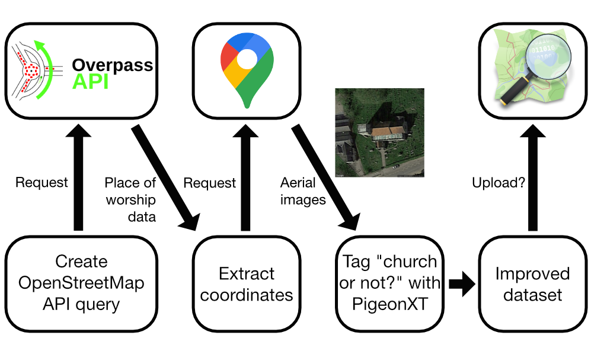

# churchtagger
Some church buildings aren't tagged properly on OpenStreetMap. Let's change that!

Church buildings are described on OpenStreetMap as ```'building'='church'```. But active churches are described with ```'amenity'='place_of_worship'```. In practice, this means that many church buildings are effectively invisible on OpenStreetMap. Here I use the OpenStreetMap Overpass API and the Google Maps Static API to collect aerial imagery of possible church buildings, then tag them through manual inspection using __[PigeonXT](https://github.com/dennisbakhuis/pigeonXT)__. The resulting dataframe could be used for semi-automated correction of the OpenStreetMap database.

